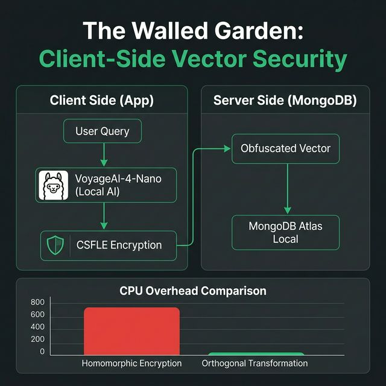
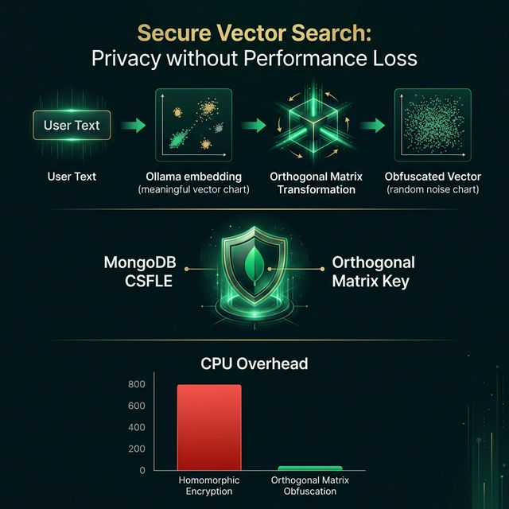

# Secure Vector Obfuscation & MongoDB CSFLE Architecture

This document outlines the architecture, mathematical foundation, and deployment model for a privacy-preserving vector search system. The solution uses **Orthogonal Matrix Obfuscation** to scramble embeddings and **MongoDB Client-Side Field Level Encryption (CSFLE)** to secure the transformation keys—all within a "Walled Garden" local environment.

---

## 🛡️ The Walled Garden: Client-Side Security
The core principle of this project is **Zero External Data Leaks**. All sensitive processing (Embedding, Transformation, Encryption) occurs on the **Client Side (Application)**.

### Key Security Zones:
1. **Client Side (Application)**: 
   - **User Query**: Raw text is captured.
   - **VoyageAI-4-Nano**: High-dimensional embeddings (1024-d) generated locally via **Ollama**.
   - **CSFLE & Obfuscation**: The secret matrix (protected by CSFLE) transforms the raw vector into an opaque, scrambled form.
2. **Server Side (MongoDB)**:
   - Only the **Obfuscated Vector** and **Encrypted Matrix** are stored. Even an admin with direct DB access cannot meaningfully interpret the vector data.

---

## 1. The Mathematical Foundation
Distance-preserving obfuscation allows nearest-neighbor searches without exposing raw data. 

An orthogonal matrix $Q$ has the property where its transpose is equal to its inverse:
$$Q^T Q = I$$

When we multiply an embedding vector $v$ by this matrix, we get an obfuscated vector $v'$. This transformation preserves Euclidean distance and dot products:
$$||v_1' - v_2'|| = ||Qv_1 - Qv_2|| = ||v_1 - v_2||$$

This mathematically guarantees that **Vector Search** queries on obfuscated data yield perfectly accurate results.

---

## 2. Performance: Privacy without Overhead
Unlike **Homomorphic Encryption (HE)**, which suffers from massive CPU overhead, our Orthogonal Transformation is near-zero overhead—it is simple matrix math.

| Method | Overhead | Privacy | Accuracy Preservation |
| :--- | :--- | :--- | :--- |
| **Homomorphic Encryption** | 📈 Massive | 🔒 Full | ✅ High |
| **Orthogonal Obfuscation** | 📉 Near Zero | 🔒 High | 🎯 100% |
| **Federated Learning** | 🔄 High | 🔒 Partial | ⚠️ Variable |

---

## 3. Deployment & Orchestration
The stack is designed for **Air-Gapped Readiness**.

- **Ollama Engine**: Serves the `voyage-4-nano` model locally. (No cloud dependency).
- **MongoDB Atlas Local**: Secure containerized vault with `privileged: true` for the KMIP key management.
- **Spring Boot Backend**: The "Client" that handles the CSFLE encryption and matrix math.
- **Next.js Frontend**: A technical dashboard providing real-time observability of search relevancy scores and audit logs.

---

## 4. End-to-End Search Flow
1. **Embed**: `query` → Ollama → 1024-d raw vector.
2. **Obfuscate**: Raw vector × $Q$ (Decrypted via CSFLE) = Obfuscated vector.
3. **Compare**: Cosine similarity is computed against obfuscated vectors in MongoDB.
4. **Audit**: Matches are returned with **Relevancy Scores** (e.g., `Score: 0.9854`) and persisted in the `audit_logs` collection.

---

## 5. Security Guardrails Summary
- **Master Key**: Protected by `.secrets/csfle_master_key.txt` (outside version control).
- **Network Isolation**: All services communicate over an internal Docker bridge; only the frontend is exposed.
- **Zero-Trust Storage**: MongoDB never sees the plaintext orthogonal matrix or raw vectors.

*Built for high-security, privacy-critical vector development.*