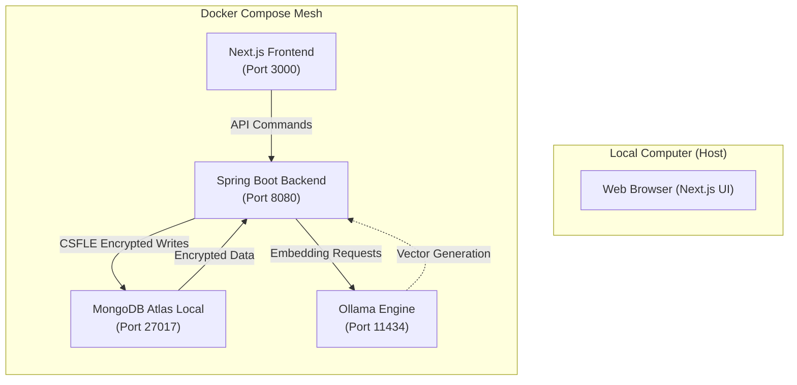
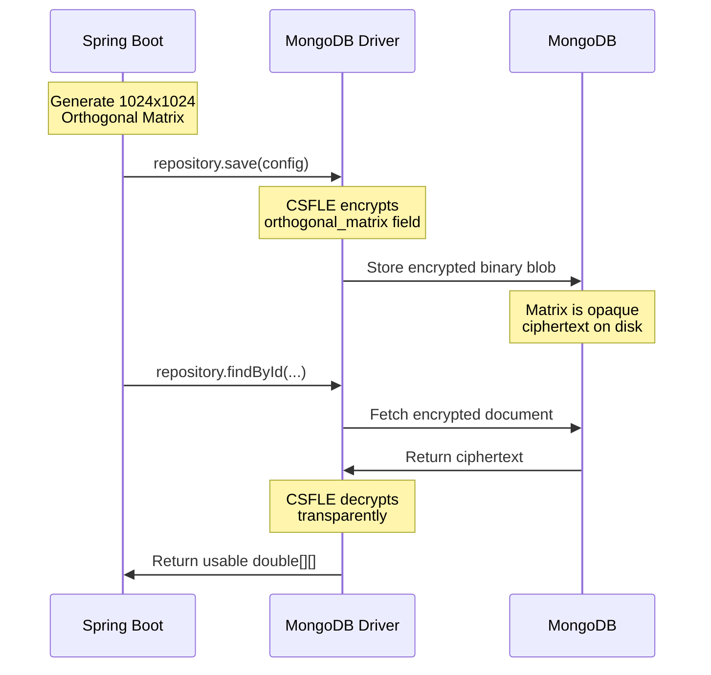
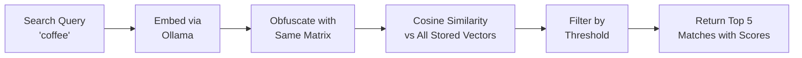
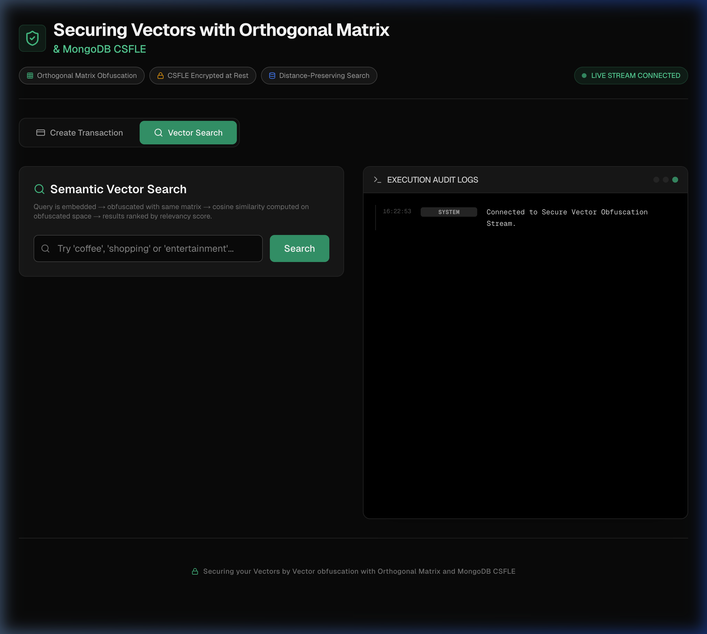

# Vector Obfuscation with MongoDB CSFLE & Ollama

A production-grade demonstration of **Client-Side Field Level Encryption (CSFLE)** combined with **Semantic Vector Search** and **Orthogonal Matrix-based Vector Obfuscation**.

This project shows how to securely store and search high-dimensional vectors (embeddings) in a local, potentially air-gapped environment while maintaining strict data privacy through MongoDB's CSFLE.

---

## 🏗️ System Architecture



### Component Deep Dive

-   **Backend (Spring Boot 3.5)**:
    -   **Vector Obfuscation Service**: Applies distance-preserving orthogonal matrix transformations to embeddings before storage.
    -   **CSFLE Configuration**: Auto-encrypts the secret orthogonal matrix using `AEAD_AES_256_CBC_HMAC_SHA_512-Random`.
    -   **Semantic Search**: Cosine similarity matching on obfuscated vectors with configurable threshold.
    -   **Audit Logging**: Persists search relevancy scores, latency, and query details to MongoDB.
    -   **WebSocket Logging**: Streams internal events (encryption, vector math, search scores) to the UI.
-   **MongoDB (Atlas Local)**:
    -   **Data Tier**: Stores transactions with obfuscated embedding vectors.
    -   **Security**: CSFLE encrypts the orthogonal matrix in `obfuscation_config`. A dedicated `encryption_vault` namespace stores key material.
    -   **Audit Trail**: The `audit_logs` collection tracks all API calls, search results, and relevancy scores.
-   **Ollama Engine**:
    -   **Local Inference**: Serves the `voyage-4-nano` model (1024 dimensions) for embedding generation without internet after the initial pull.
-   **Frontend (Next.js)**:
    -   **UPI Tab**: Create transactions with merchant, amount, and description.
    -   **Search Tab**: Semantic search with live results showing matched transactions.
    -   **Live Logs**: Real-time observability panel showing CSFLE, obfuscation, and search events.

---

## 🔐 How CSFLE Protects the System

The orthogonal matrix is the **"secret key"** that powers vector obfuscation. If exposed, an attacker could reverse the transformation and recover original embeddings. CSFLE ensures the matrix is **never stored in plaintext**.

### Encryption Flow



### What's Protected

| Field | In Application | In MongoDB | Purpose |
| :--- | :--- | :--- | :--- |
| `orthogonal_matrix` | `double[][]` (usable) | 🔒 Encrypted binary | Secret transformation key |
| `obfuscated_vector` | `double[]` (usable) | `double[]` (visible but scrambled) | Searchable embedding |
| `description` | Plain text | Plain text | Transaction description |

> **Key Insight**: The obfuscated vectors are visible in the database but **meaningless** without the encrypted matrix. Even a database admin cannot reverse the obfuscation.

---

## 🛡️ Vector Obfuscation & Semantic Search

### How It Works

1.  **Embed**: Transaction description → Ollama (`voyage-4-nano`) → 1024-d raw vector
2.  **Obfuscate**: Raw vector × Orthogonal Matrix = Obfuscated vector
3.  **Store**: Obfuscated vector saved to MongoDB (matrix encrypted via CSFLE)

### Search Flow



Because the matrix is **orthogonal**, cosine similarity and distances are mathematically **preserved** after transformation. The search works identically on obfuscated vectors as it would on raw vectors.

### Relevancy Scoring & Audit Logging

Every search produces:
-   **Console Logs**: `Candidate Score: Merchant=Starbucks, Score=0.7137`
-   **API Logs (WebSocket)**: `Match: Starbucks | Score: 0.7137 | Description: Morning Coffee`
-   **Database (`audit_logs`)**: Persisted with `eventType: VECTOR_SEARCH_MATCH`, `relevancyScore`, `latencyMs`, and full query context.

---

## 🚀 Getting Started

### Prerequisites
- Docker & Docker Compose
- `make` utility

### Installation

1.  **Initialize the Environment**:
    Generates the 96-byte CSFLE master key and creates the secrets directory.
    ```bash
    make init
    ```

2.  **Build the Images**:
    Compiles the Spring Boot backend and Next.js frontend into Docker images.
    ```bash
    make build
    ```

3.  **Start the Stack**:
    Spins up MongoDB Atlas Local, Backend, Frontend, and Ollama with deterministic startup coordination.
    ```bash
    make up
    ```

4.  **Verify Model Pull**:
    The system automatically pulls the `voyage-4-nano` model on first startup.
    ```bash
    docker logs -f vector-obfuscation-with-csfle-ollama
    ```

### Make Commands

| Command | Description |
| :--- | :--- |
| `make init`  | Generate CSFLE master key and setup secrets |
| `make build` | Build all Docker images |
| `make up`    | Start the full stack |
| `make down`  | Stop all containers |
| `make logs`  | Tail logs for all services |
| `make clean` | Stop containers, remove volumes, and purge state |

---

## ⚙️ Environment Configuration

All configuration is managed via the `.env` file:

| Variable | Default | Description |
| :--- | :--- | :--- |
| `MONGO_PORT` | `27017` | MongoDB external port |
| `MONGO_DATABASE` | `obfuscation_db` | Target database name |
| `MONGO_URI` | `mongodb://mongo:27017/...` | Connection string with `directConnection=true` |
| `MONGO_VAULT_NAMESPACE` | `encryption_vault.keyVault` | CSFLE key vault namespace |
| `BACKEND_PORT` | `8080` | Spring Boot API port |
| `VECTOR_DIMENSION` | `1024` | Embedding dimensions (must match Ollama model) |
| `OLLAMA_MODEL` | `nub235/voyage-4-nano` | Ollama embedding model |
| `SIMILARITY_THRESHOLD` | `0.7` | Minimum cosine similarity for search matches |
| `FRONTEND_PORT` | `3000` | Next.js UI port |

---

## 🔍 Usage & Testing

### 1. Access the Frontend
Open your browser to: **[http://localhost:3000](http://localhost:3000)**



-   **UPI Tab**: Enter a merchant (e.g., "Starbucks"), amount, and description (e.g., "Morning Coffee"), then click **Pay**.
-   **Search Tab**: Type a query (e.g., "coffee") and see semantically matched transactions with relevancy scores.
-   **Live Logs**: Watch real-time events for CSFLE encryption, vector obfuscation, and similarity scoring.

### 2. Test Embedding API (Ollama)
```bash
curl -X POST http://localhost:11434/api/embeddings \
-d '{"model": "nub235/voyage-4-nano", "prompt": "UPI Payment for coffee"}'
```

### 3. Test Transaction API
```bash
# Create a transaction
curl -X POST http://localhost:8080/api/v1/transactions \
-H "Content-Type: application/json" \
-d '{"merchant": "Starbucks", "amount": 150.00, "description": "Morning Coffee"}'

# Search for transactions
curl "http://localhost:8080/api/v1/transactions/search?query=coffee"
```

### 4. Verify Audit Logs
```bash
docker exec vector-obfuscation-with-csfle-mongo mongosh --quiet --eval \
  "db.getSiblingDB('obfuscation_db').audit_logs.find({eventType: 'VECTOR_SEARCH_MATCH'}).sort({timestamp: -1}).limit(3).toArray()"
```

---

## 🔒 Security Summary

| Layer | Mechanism | What It Protects |
| :--- | :--- | :--- |
| **CSFLE** | `AEAD_AES_256_CBC_HMAC_SHA_512-Random` | Orthogonal matrix (the obfuscation secret) |
| **Vector Obfuscation** | Orthogonal matrix multiplication | Raw embeddings (prevents reverse engineering) |
| **Docker Secrets** | File-based secret injection | 96-byte CSFLE master key |
| **Network Isolation** | `obfuscation-net` bridge network | Inter-service communication |

### Key Files
-   **Master Key**: `.secrets/csfle_master_key.txt` (auto-generated by `make init`)
-   **Crypt Shared Library**: `docker/lib/mongo_crypt_v1.so` (required for offline CSFLE)

---

## 🐳 Docker Architecture

The stack uses **deterministic startup coordination**:

```
MongoDB Atlas Local (healthcheck: mongosh ping)
    ↓ service_healthy
Spring Boot Backend (connects to healthy MongoDB)
    ↓ depends_on
Next.js Frontend (proxies to backend API)

Ollama Engine (independent, pulls model on first start)
```

MongoDB runs with `privileged: true` and a dedicated `configdb` volume to allow the Atlas engine to manage its internal security keyfiles.

---

*Built with ❤️ for secure vector development.*
